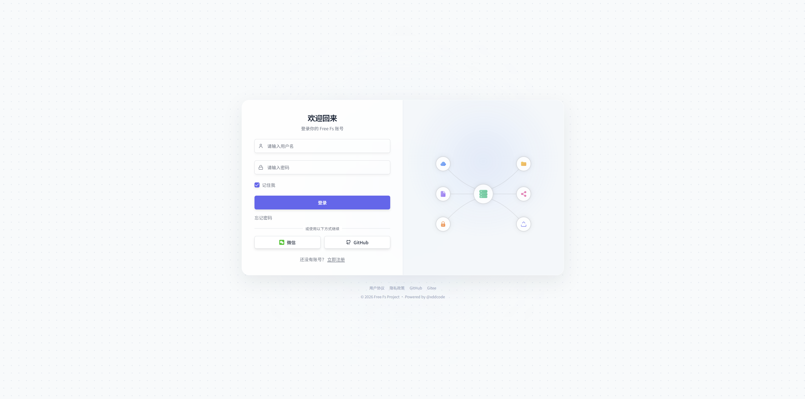
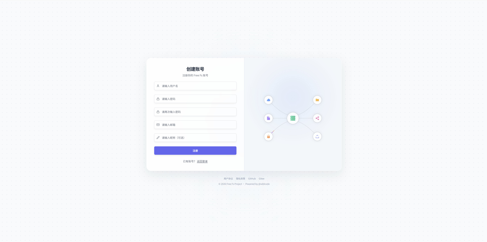
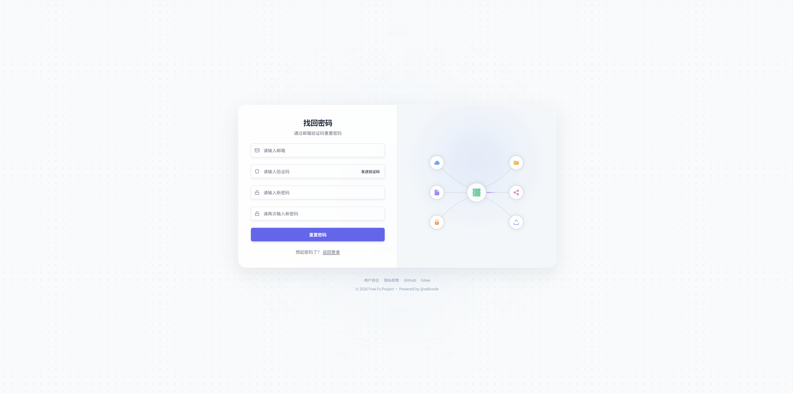
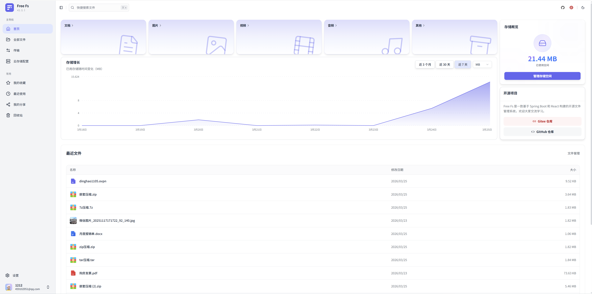

<div align="center">


# Free FS

### Modern File Management & Cloud Storage System

An enterprise-level file management and cloud storage system backend based on Spring Boot 4.x, focusing on providing high-performance and reliable file storage and management services.

 
 

[](https://gitee.com/dromara/free-fs/stargazers)
[](https://gitee.com/dromara/free-fs/members)
[](https://github.com/dromara/free-fs/stargazers)
[](https://github.com/dromara/free-fs/network)
[](https://gitee.com/dromara/free-fs/blob/master/LICENSE)

[Issue Tracker](https://gitee.com/dromara/free-fs/issues) · [Feature Request](https://gitee.com/dromara/free-fs/issues/new)

[Documentation](https://free-fs.top/) | [中文文档](./README.zh-CN.md)

</div>

---

## Repository

[Gitee: https://gitee.com/dromara/free-fs](https://gitee.com/dromara/free-fs)

[GitHub: https://github.com/dromara/free-fs](https://github.com/dromara/free-fs)

## Frontend Repository

### 🚀 Recommended (Latest)

[](https://gitee.com/xddcode/free-fs-frontend.git)

---

## Features

### Core Highlights

- **Large File Upload** - Chunked upload, resumable upload, instant upload with TB-level file support
- **Real-time Progress** - Real-time upload progress tracking, accurate to chunk level
- **Instant Upload** - MD5-based dual verification for instant file completion
- **Pluggable Storage** - SPI mechanism for hot-swappable storage, integrate new platforms in 5 minutes
- **Workspace** - Multi-workspace support for efficient team collaboration
- **Internationalization** - Chinese and English bilingual support, easily extensible
- **Modular Architecture** - Clear layered design, easy to maintain and extend
- **Online Preview** - Support multiple file formats with anti-hotlink protection
- **Secure & Reliable** - JWT authentication, permission control, file integrity verification

### Feature List

- **File Management**
    - File upload (chunked, resumable, instant)
    - File preview
    - File download
    - Folder creation and management
    - File/folder rename and move
    - File sharing with access code
    - File deletion

- **Workspace** 🆕
    - Multi-workspace management
    - Workspace member management
    - Role-based access control
    - Member invitation (email invitation)
    - Workspace switching

- **Team Collaboration** 🆕
    - Member invitation and management
    - Role permission assignment
    - Workspace isolation
    - Member permission control

- **Internationalization** 🆕
    - Simplified Chinese
    - English
    - Extensible for more languages

- **Authentication & Authorization**
    - Username/password login
    - Email verification code login 🆕
    - JWT Token authentication
    - Role-based access control (RBAC)

- **Recycle Bin**
    - File restoration (batch operation supported)
    - Permanent deletion (batch operation supported)
    - One-click empty recycle bin
    - Auto-cleanup mechanism

- **Storage Platform**
    - Multiple storage platforms (Local, MinIO, Aliyun OSS, Qiniu Kodo, S3-compatible, etc.)
    - One-click platform switching
    - Platform configuration management
    - Storage space statistics

### Preview Support

**The system supports preview for the following file types by default**:

- Images: jpg, jpeg, png, gif, bmp, webp, svg, tif, tiff
- Documents: pdf, doc, docx, xls, xlsx, csv, ppt, pptx
- Text/Code: txt, log, ini, properties, yaml, yml, conf, java, js, jsx, ts, tsx, py, c, cpp, h, hpp, cc, cxx, html, css, scss, sass, less, vue, php, go, rs, rb, swift, kt, scala, json, xml, sql, sh, bash, bat, ps1, cs, toml
- Markdown: md, markdown
- Audio/Video: mp4, avi, mkv, mov, wmv, flv, webm, mp3, wav, flac, aac, ogg, m4a, wma
- Archives: zip, rar, 7z, tar (view directory structure, preview files in archive)
- Others: drawio

---

## Quick Start

### Requirements

- JDK >= 21
- Maven >= 3.8
- MySQL >= 8.0 or PostgreSQL >= 14
- Redis

### Installation

```bash
# Clone the repository
git clone https://gitee.com/dromara/free-fs.git

# Enter project directory
cd free-fs

# Build the project
mvn clean install -DskipTests
```

### Configuration

1. **Initialize Database**

   ```bash
   # MySQL
   mysql -u root -p < _sql/mysql/free-fs.sql
   ```

   ```bash
   # PostgreSQL
   psql -U postgres -c "CREATE DATABASE free-fs;"
   psql -U postgres -d free-fs -f _sql/postgresql/free-fs_pg.sql
   ```

2. **Modify Configuration**

   Update database and Redis configuration in `fs-admin/src/main/resources/application-dev.yml`

### Run

```bash
# Start the application
cd fs-admin
mvn spring-boot:run

# Or run FreeFsApplication in your IDE
```

Access:

- Service: http://localhost:8080
- API Documentation: http://localhost:8080/swagger-ui.html

### Default Account

| Username | Password |
|----------|----------|
| admin    | admin    |

---

## Screenshots

| Feature | Screenshot 1 | Screenshot 2 | Screenshot 3 |
|---------|-------------|-------------|-------------|
| Login |  |  |  |
| Dashboard |  | | |
| My Files |  |  | |
| Recycle Bin |  |  | |
| File Sharing |  |  |  |
| Move Files |  | | |
| Transfer |  | | |
| Storage Platform |  |  |  |
| Profile |  |  | |

---

## Project Structure

```
free-fs/
├── fs-admin/                    # Web admin module
├── fs-dependencies/             # Dependency management (BOM)
├── fs-framework/                # Framework layer
│   ├── fs-common-core/          # Common core module
│   ├── fs-notify/               # Notification module (email)
│   ├── fs-orm/                  # ORM configuration
│   ├── fs-preview/              # Preview wrapper
│   ├── fs-redis/                # Redis configuration
│   ├── fs-security/             # Security & authentication
│   ├── fs-swagger/              # API documentation
│   ├── fs-sse/                  # SSE support
│   └── fs-storage-plugin/       # Storage plugin framework
│       ├── storage-plugin-boot/        # Plugin core management
│       ├── storage-plugin-core/        # Plugin core interface
│       ├── storage-plugin-local/       # Local storage plugin
│       ├── storage-plugin-aliyunoss/   # Aliyun OSS plugin
│       ├── storage-plugin-kodo/        # Qiniu Kodo plugin
│       ├── storage-plugin-obs/         # Tencent Cloud OBS plugin
│       ├── storage-plugin-minio/       # MinIO plugin
│       └── storage-plugin-rustfs/      # RustFS plugin
└── fs-modules/                  # Business modules
    ├── fs-file/                 # File management
    ├── fs-storage/              # Storage platform management
    ├── fs-system/               # System management (user, workspace, role, permission)
    ├── fs-log/                  # Logging module
    └── fs-plan/                 # Scheduled tasks
```

---

## Contributing

We welcome all contributions, whether it's new features, bug fixes, or documentation improvements!

### How to Contribute

1. Fork this repository
2. Create your feature branch (`git checkout -b feature/AmazingFeature`)
3. Commit your changes (`git commit -m 'Add some AmazingFeature'`)
4. Push to the branch (`git push origin feature/AmazingFeature`)
5. Open a Pull Request

### Code Standards

- Follow Alibaba Java Coding Guidelines
- Use Lombok to simplify code
- Write clear comments
- Follow [Conventional Commits](https://www.conventionalcommits.org/)

### Commit Convention

```
feat: New feature
fix: Bug fix
docs: Documentation update
style: Code formatting
refactor: Code refactoring
perf: Performance optimization
test: Testing related
chore: Build/toolchain update
```

---

## Issue Tracker

If you find a bug or have a feature suggestion, please report it via:

- [Gitee Issues](https://gitee.com/dromara/free-fs/issues)

---

## License

This project is licensed under the [Apache License 2.0](LICENSE).

---

## Acknowledgments

- [Spring Boot](https://spring.io/projects/spring-boot) - Thanks to the Spring team
- [MyBatis Flex](https://mybatis-flex.com/) - Thanks to the MyBatis Flex team
- [Sa-Token](https://sa-token.cc/) - Thanks to the Sa-Token team
- All contributors and users

---

## Links

- enjoy-iot Open source IoT platform, complete IoT solution - **[https://gitee.com/open-enjoy/enjoy-iot](https://gitee.com/open-enjoy/enjoy-iot)**

---

## Contact

- GitHub: [@Freedom](https://github.com/xddcode)
- Gitee: [@Freedom](https://gitee.com/xddcode)
- Email: xddcodec@gmail.com
- WeChat:

  **Please indicate your purpose when adding WeChat**


- WeChat Group:


- WeChat Official Account:


---

## ❤ Donate

If you think the free-fs project can help you, or bring you convenience and inspiration, or you agree with this project, you can sponsor my efforts!

Please give a ⭐️ to support!


<div align="center">

Made with ❤️ by [@xddcode](https://gitee.com/xddcode)

</div>
